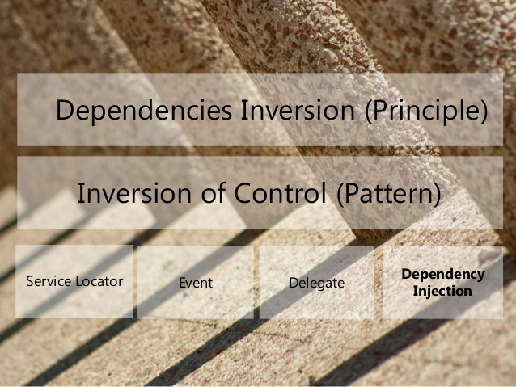

# DIPrinciple
## SOLID principles :
SOLID principles là một nguyên lý thiết kế được công bố bởi Robert C.Martin. SOLID là một nguyên tắc thiết kế nổi tiếng nhất trong lập trình hướng đối tượng. Nó viết tắt của 5 nguyên lý sau.
* Single responsibility
* Open - close
* Liskov substitution 
* Interface segregation.
* Dependency inversion. 

### Single responsibility.
* Benefit: make your software easier to implement and prevents những rủi do không mong muốn khi thay đổi trong tương lai… 
* Mỗi class hay 1 component nên chỉ làm duy nhất 1 trách nhiệm nhất định. Mỗi khi có thay đổi về yêu cầu về trách nhiệm của 1 class chúng ta nên đặt câu hỏi: : What is the responsibility of your class/component/microservice?

### Open - close

### Liskov substitution 
### Interface segregation.

### Dependency inversion. 

  

The dependency inversion principle is a specific form of decoupling software modules.
When following this principle, the conventional dependency relationships established from high-level, policy-setting modules to low-level, dependency modules are reversed,
 thus rendering **high-level modules independent of the low-level module implementation details**. 
 
The principle states:

- **High-level modules should not depend on low-level modules. Both should depend on abstractions (e.g. interfaces)**.
- **Abstractions should not depend on details. Details (concrete implementations) should depend on abstractions.**

##### Example 
- Main class
```C#
class Program
    {
        static void Main(string[] args)
        {
            Person owner = new Person
            {
                FirstName = "Tim",
                LastName = "Corey",
                EmailAddress = "tim@iamtimcorey.com",
                PhoneNumber = "555-1212"
            };

            Chore chore = new Chore
            {
                choreName = "Take out the trash",
                owner = owner //assign chore for a owner
            };

            chore.PerformedWork(3);
            chore.PerformedWork(1.5);
            chore.CompleteChore();

            Console.ReadLine();
        }
    }
```
--> Main class is **High-Level** , it depending **Low-Level** class are Person and Chore. 
- Chore class
```C#
 public class Chore
    {
        public string choreName { get; set; }
        public Person owner { get; set; }
        public double hoursWorked { get; private set; }
        public bool isComplete { get; private set; }

        public void PerformedWork(double hours)
        {
            hoursWorked += hours;
            Logger log = new Logger();
            log.Log($"Performed work on { choreName }");
        }

        public void CompleteChore()
        {
            isComplete = true;

            Logger log = new Logger();  /// **Problem in here**
            log.Log($"Completed { choreName }");

            Emailer emailer = new Emailer();
            emailer.SendEmail(owner, $"The chore { choreName } is complete.");
        }
    }
```
--> Chore class is **High-Level** , it depending **Low-Level** class are Person, Email and Logger. 

- Person class
```C#
 public class Person
    {
        public string FirstName { get; set; }
        public string LastName { get; set; }
        public string PhoneNumber { get; set; }
        public string EmailAddress { get; set; }   
    }
```
- Logger Class
```C#
  public class Logger
      {
          public void Log(string message)
          {
              Console.WriteLine($"Write to Console: { message }");
          }
      }
  ```
##### Problems in the example above : 
The high level depending low-level.  Trong main class chúng ta đang depend 1 low-level cụ thể là Chore class.
 Nếu chúng ta muốn thay đổi, depend another class. Example : ChoreTest class  -> Điều này là bất khả thi. 


  ==> Difficult for scale-up and test.
##### Solutions, What's  DI(dependence inversion) expect ?
**High-level modules should not depend on low-level modules. Both should depend on abstractions (e.g. interfaces)**.
We need define abstracts (interface) for both High-level module and Low-level module depend this. Let's do this.
```c#
public interface IPerson
    {
        string EmailAddress { get; set; }
        string FirstName { get; set; }
        string LastName { get; set; }
        string PhoneNumber { get; set; }
    }
```
```c#
public interface IChore
    {
        string choreName { get; set; }
        double hoursWorked { get; }
        bool isComplete { get; }
        IPerson owner { get; set; }

        void CompleteChore();
        void PerformedWork(double hours);
    }
```

Let implement the interface above to class

```C#
 public class Person : IPerson
    {
        public string firstName { get; set; }
        public string lastName { get; set; }
        public string phoneNumber { get; set; }
        public string emailAddress { get; set; }
    }
```
```C#
 public class Chore : IChore
    {
        ILogger _logger; // use interface
        IMessageSender _messageSender; //use interface

        public string choreName { get; set; }
        public IPerson owner { get; set; }
        public double hoursWorked { get; private set; }
        public bool isComplete { get; private set; }

        public Chore(ILogger logger, IMessageSender messageSender) // dependence interface instead of class.
        {
            _logger = logger;
            _messageSender = messageSender;
        }

        public void PerformedWork(double hours)
        {
            hoursWorked += hours;
            _logger.Log($"Performed work on { choreName }");
        }

        public void CompleteChore()
        {
            isComplete = true;

            _logger.Log($"Completed { choreName }");

            _messageSender.SendMessage(owner, $"The chore { choreName } is complete.");
        }
    }
```
--> The results: The High-level is depending a abstract, it's not dependence low-level directly. If we want to the Chore is not dependence Person,
I want change it to dependence PersonTest. I'll just create a new class PersonTest implement IPerson . I can pass this into Chore class.  


##### Generalization Retrictsion: 
- All member variables in a class must be interfaces or abstracts.
- All concrete class packages must connect only through interface or abstract class packages.
- No class should derive from a concrete class.
- No method should override an implemented method.
- All variable instantiation requires the implementation of a creational pattern such as the factory method or the factory pattern, or the use of a **dependency-injection** framework.


Think bigger :
Continue see above example. If when we project growth and bigger than. We need to centralize instantiation for reuse purpose. 
--> Use creational pattern such as the factory method or the factory pattern, or the use of a **dependency-injection** framework.
Create a Factory class for example above:
```java
public class Factory {
   
    public static IPerson createPerson() {
        return new Person();
    }
    public static IChore createChore() {
        return new Chore(); 
    }

}
```


  
